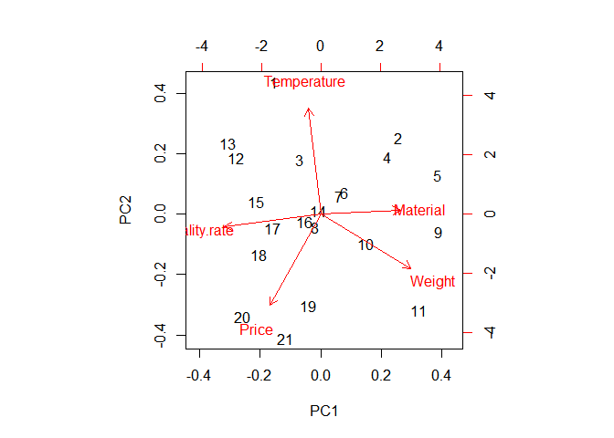
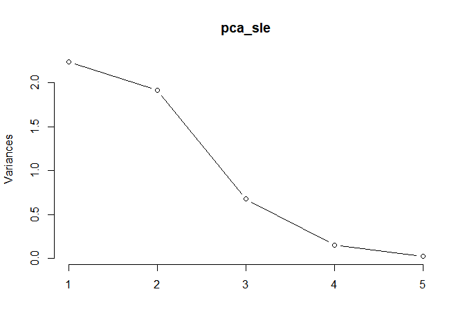
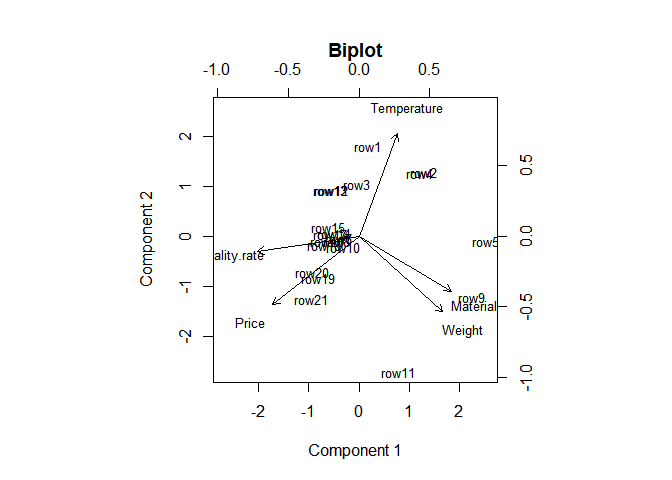
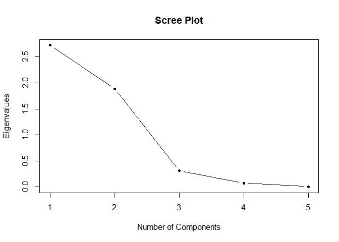

princals in R
================

  - [1. Pca](#1-pca)
  - [2. princals](#2-princals)
  - [구현하지 못한것.](#구현하지-못한것)

``` r
library(Gifi)
```

    ## Warning: package 'Gifi' was built under R version 3.6.3

``` r
sleeping <- read.csv("sleeping.csv")

rownames(sleeping)<- sleeping[,1]
sleeping <- sleeping[,-1]
```

``` r
sleepingNUM <- makeNumeric(sleeping)
```

## 1\. Pca

``` r
pca_sle<-prcomp(sleepingNUM,scale. = T,center = T)
pca_slee<-princomp(sleepingNUM)
```

``` r
biplot(pca_sle)
```

<!-- -->

``` r
screeplot(pca_sle,type="l")
```

<!-- -->

## 2\. princals

``` r
test <- princals(sleepingNUM)
test1<-homals(sleepingNUM)
test1$quantifications
```

    ## $Temperature
    ##              D1          D2
    ## -15  0.17595449 -0.33852531
    ## -10  0.13747623  0.02725063
    ## -7  -0.01609206  0.19784832
    ## -3   0.15596736 -0.10733266
    ## 0   -0.36993482 -0.14107437
    ## 3   -0.11947637  0.12024217
    ## 7    0.14199559  0.23246764
    ## 
    ## $Weight
    ##                D1          D2
    ## 800   0.017374778  0.17725728
    ## 940   0.142030703  0.23252086
    ## 970   0.007724932  0.19852472
    ## 1200  0.116903228  0.07440171
    ## 1280 -0.112166458 -0.02390667
    ## 1380  0.046681309  0.20443562
    ## 1390  0.109516423  0.14784029
    ## 1450  0.025180171  0.41804098
    ## 1460  0.070248820  0.17356875
    ## 1490  0.144337922 -0.18029331
    ## 1500  0.157864889 -0.10939419
    ## 1550  0.181373235 -0.14501194
    ## 1690  0.179491374 -0.17616330
    ## 1750 -0.482643437 -0.15717280
    ## 1800  0.131634527 -0.05955279
    ## 1820  0.165408661 -0.09338030
    ## 1850  0.061025347  0.03328722
    ## 1880 -0.383601878 -0.01516584
    ## 1900 -0.514949409 -0.24207591
    ## 2060 -0.283626476  0.15986331
    ## 2100  0.220191337 -0.61762368
    ## 
    ## $Price
    ##              D1          D2
    ## 139 -0.38360237 -0.01516270
    ## 149  0.14203161  0.23251514
    ## 179 -0.48264340 -0.15717307
    ## 239 -0.51494893 -0.24207897
    ## 249 -0.11216607 -0.02390912
    ## 279 -0.28362646  0.15986324
    ## 299  0.16285658 -0.16265901
    ## 329  0.17949208 -0.17616778
    ## 339  0.02517977  0.41804353
    ## 349  0.04169360  0.13832804
    ## 369  0.11690328  0.07440137
    ## 379  0.00772424  0.19852912
    ## 399  0.22019002 -0.61761540
    ## 419  0.15786523 -0.10939638
    ## 449  0.07024880  0.17356890
    ## 549  0.14852116 -0.07646380
    ## 669  0.10951590  0.14784363
    ## 
    ## $Material
    ##            D1          D2
    ## 1  0.13839317 -0.03202191
    ## 2  0.08394109  0.09054941
    ## 3 -0.43313366 -0.08613673
    ## 4  0.16174421  0.04362934
    ## 5  0.03108859 -0.05703901
    ## 6  0.02515500  0.41811565
    ## 7 -0.28363056  0.15987547
    ## 8 -0.51492738 -0.24214121
    ## 9  0.22014893 -0.61749822
    ## 
    ## $quality.rate
    ##            D1          D2
    ## 1 -0.41620529 -0.06363791
    ## 2  0.15852756 -0.18408287
    ## 3  0.05551282  0.15431317

``` r
plot(test,"biplot")
```

<!-- -->

``` r
plot(test,"screeplot")
```

<!-- -->

## 구현하지 못한것.

``` r
test$quantifications$Material
```

    ##                  D1            D2
    ##  [1,] -1.005799e-01  5.974675e-02
    ##  [2,] -2.011598e-01  1.194935e-01
    ##  [3,]  5.004670e-16 -3.336446e-16
    ##  [4,] -7.138484e-02  4.240422e-02
    ##  [5,]  4.006172e-16 -2.724197e-16
    ##  [6,] -7.138484e-02  4.240422e-02
    ##  [7,]  3.330669e-16 -2.220446e-16
    ##  [8,]  8.608922e-01 -5.113896e-01
    ##  [9,]  0.000000e+00  0.000000e+00
    ## [10,]  4.304461e-01 -2.556948e-01

``` r
test1$quantifications$Material
```

    ##            D1          D2
    ## 1  0.13839317 -0.03202191
    ## 2  0.08394109  0.09054941
    ## 3 -0.43313366 -0.08613673
    ## 4  0.16174421  0.04362934
    ## 5  0.03108859 -0.05703901
    ## 6  0.02515500  0.41811565
    ## 7 -0.28363056  0.15987547
    ## 8 -0.51492738 -0.24214121
    ## 9  0.22014893 -0.61749822

``` r
test$loadings
```

    ##                      D1         D2
    ## Temperature   0.3410651  0.9036466
    ## Weight        0.7408984 -0.6683435
    ## Price        -0.7651753 -0.6077775
    ## Material      0.8166278 -0.4855498
    ## quality.rate -0.8963596 -0.1332796
