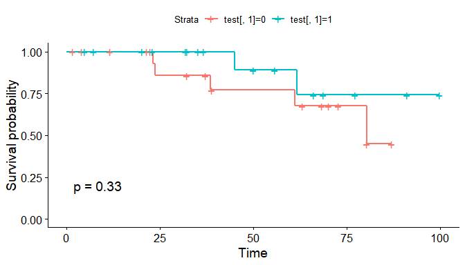
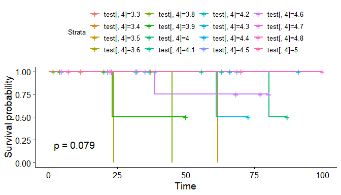
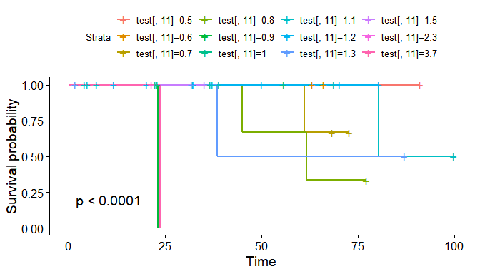
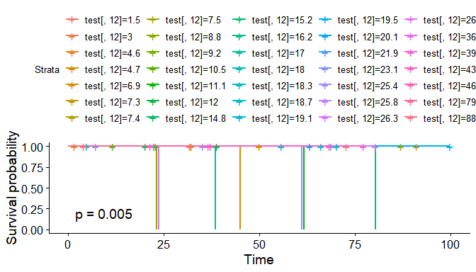

survivals in R
================

  - [0. structure](#0-structure)
  - [1. package(Survival)](#1-packagesurvival)
  - [2. ggsurvplot을 이용하여, pvalue 등을
    파악](#2-ggsurvplot을-이용하여-pvalue-등을-파악)
  - [3. 앞선 pvalue를 토대로 0.1보다 작은 변수들을 선택후, coxph 모델을 이용하여 ratio -
    harzard를
    구한다.](#3-앞선-pvalue를-토대로-01보다-작은-변수들을-선택후-coxph-모델을-이용하여-ratio---harzard를-구한다)

``` r
library(survival)
library(Gifi)
library(survminer)
library(readr)
```

### 0\. structure

``` r
a<- read.csv("dat3.csv")
a$Initial_tx <- as.factor(a$Initial_tx)
a$child_Pugh_class_p <- as.factor(a$child_Pugh_class_p)
a$gender <- as.factor(a$gender)
a$bileduct <- as.factor(a$bileduct)
a$perihv<- as.factor(a$perihv)
a$peripv <- as.factor(a$peripv)
a$subcapsular <- as.factor(a$subcapsular)
a$Subphrenic <- as.factor(a$Subphrenic)
a <- a[,-17] ## 값이 0 밖에 존재하지 않아여 지우기
```

  - 17번 periivc 의 변수는 0밖에 존재하지 않기에 제거한다.

<!-- end list -->

``` r
test <- a
test <- na.omit(test)
```

### 1\. package(Survival)

``` r
survi <- Surv(time = test$os_time, event = test$death)
fit1 <- survfit(survi~test$Initial_tx,data=test)
fit1
```

    ## Call: survfit(formula = survi ~ test$Initial_tx, data = test)
    ## 
    ##                    n events median 0.95LCL 0.95UCL
    ## test$Initial_tx=0 19      5   80.3    61.1      NA
    ## test$Initial_tx=1 18      2     NA    61.7      NA

1.  변수명 os\_time을 시간으로, death를 event로 지정한다.
2.  survfit 함수를 사용하여

### 2\. ggsurvplot을 이용하여, pvalue 등을 파악

``` r
par(mfrow = c(4,5))

 ggsurvplot(survfit(survi~test[,1]),data=test,pval=T)
```



``` r
ggsurvplot(survfit(survi~test[,4]),data=test,pval=T) #
```



``` r
ggsurvplot(survfit(survi~test[,5]),data=test,pval=T) #
```


``` r
ggsurvplot(survfit(survi~test[,6]),data=test,pval=T) #
```


``` r
ggsurvplot(survfit(survi~test[,7]),data=test,pval=T)  
```


``` r
ggsurvplot(survfit(survi~test[,8]),data=test,pval=T) #
```


``` r
  ggsurvplot(survfit(survi~test[,9]),data=test,pval=T) ## 의미없는 범주형
```


``` r
ggsurvplot(survfit(survi~test[,10]),data=test,pval=T) #
```


``` r
ggsurvplot(survfit(survi~test[,11]),data=test,pval=T) #
```



``` r
ggsurvplot(survfit(survi~test[,12]),data=test,pval=T) #
```



``` r
 ggsurvplot(survfit(survi~test[,13]),data=test,pval=T) #범주형 #
```


``` r
 ggsurvplot(survfit(survi~test[,14]),data=test,pval=T) #범주형 #
```


``` r
 ggsurvplot(survfit(survi~test[,15]),data=test,pval=T) #범주형
```


``` r
  ggsurvplot(survfit(survi~test[,16]),data=test,pval=T) ## 의미없는 범주형
```


``` r
 ggsurvplot(survfit(survi~test[,17]),data=test,pval=T) #범주형 #
```


``` r
 ggsurvplot(survfit(survi~test[,18]),data=test,pval=T) #범주형
```


#### p\_value 계산

``` r
cox_f<-function(x){
  result <- coxph(survi~test[,x],data=test)
  print(result)
}
```

### 3\. 앞선 pvalue를 토대로 0.1보다 작은 변수들을 선택후, coxph 모델을 이용하여 ratio - harzard를 구한다.

``` r
x <- test[,c(4,5,6,7,8,10,11,12)]
result0<-coxph(survi~.,data=x)
```

#### 3-1. 나이변수 age

1.  나이변수 age를 60세 기준으로 나눈뒤 다시 검정시킨다.

<!-- end list -->

``` r
test$age_p
```

    ##  [1] 68 60 74 74 49 79 60 60 61 57 47 58 61 53 63 57 63 56 49 55 46 66 64 73 51
    ## [26] 75 65 56 53 65 49 57 50 60 43 47 60

``` r
nx<-x %>%
  mutate(nage = ifelse(age_p>=60,1,0))

n_x <- nx[,-6]
result1 <-coxph(survi~.,data=n_x)
```

#### 4\. ggforest 를 사용하여 ratio-harzard를 구한다.

``` r
ggforest(result0)
```


``` r
ggforest(result1)
```


