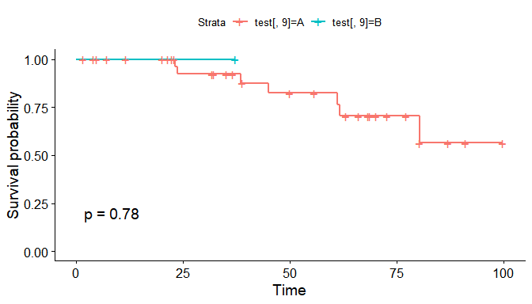
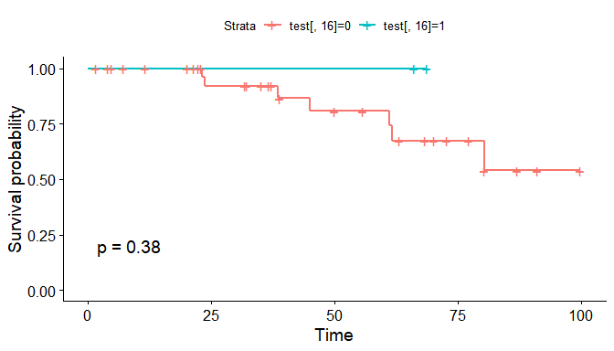
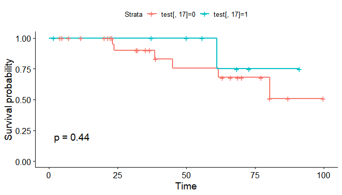

survivals in R
================

  - [0. 각각의 structure를 고려하기.](#0-각각의-structure를-고려하기)
  - [1. package(Survival)](#1-packagesurvival)
  - [some thing2](#some-thing2)

``` r
library(survival)
library(Gifi)
library(survminer)
library(readr)
```

### 0\. 각각의 structure를 고려하기.

``` r
a<- read.csv("dat3.csv")
a$Initial_tx <- as.factor(a$Initial_tx)
a$child_Pugh_class_p <- as.factor(a$child_Pugh_class_p)
a$gender <- as.factor(a$gender)
a$bileduct <- as.factor(a$bileduct)
a$perihv<- as.factor(a$perihv)
a$peripv <- as.factor(a$peripv)
a$subcapsular <- as.factor(a$subcapsular)
a$Subphrenic <- as.factor(a$Subphrenic)
a <- a[,-17] ## 값이 0 밖에 존재하지 않아여 지우기
```

  - 17번 periivc 의 변수는 0밖에 존재하지 않기에 제거한다.

<!-- end list -->

``` r
test <- a
test <- na.omit(test)
```

### 1\. package(Survival)

``` r
survi <- Surv(time = test$os_time, event = test$death)
fit1 <- survfit(survi~test$Initial_tx,data=test)
```

  - 1.  변수명 os\_time을 시간으로, death를 event로 지정한다.

  - 2.  survfit 함수를 사용하여

\#\#\#.

1.  ggsurvplot을 사용

### some thing2

``` r
 ggsurvplot(survfit(survi~test[,1]),data=test,pval=T)
```


``` r
ggsurvplot(survfit(survi~test[,4]),data=test,pval=T) #
```


``` r
ggsurvplot(survfit(survi~test[,5]),data=test,pval=T) #
```


``` r
ggsurvplot(survfit(survi~test[,6]),data=test,pval=T) #
```


``` r
ggsurvplot(survfit(survi~test[,7]),data=test,pval=T)  
```


``` r
ggsurvplot(survfit(survi~test[,8]),data=test,pval=T) #
```


``` r
  ggsurvplot(survfit(survi~test[,9]),data=test,pval=T) ## 의미없는 범주형
```



``` r
ggsurvplot(survfit(survi~test[,10]),data=test,pval=T) #
```


``` r
ggsurvplot(survfit(survi~test[,11]),data=test,pval=T) #
```


``` r
ggsurvplot(survfit(survi~test[,12]),data=test,pval=T) #
```


``` r
 ggsurvplot(survfit(survi~test[,13]),data=test,pval=T) #범주형 #
```


``` r
 ggsurvplot(survfit(survi~test[,14]),data=test,pval=T) #범주형 #
```


``` r
 ggsurvplot(survfit(survi~test[,15]),data=test,pval=T) #범주형
```


``` r
  ggsurvplot(survfit(survi~test[,16]),data=test,pval=T) ## 의미없는 범주형
```



``` r
 ggsurvplot(survfit(survi~test[,17]),data=test,pval=T) #범주형 #
```



``` r
 ggsurvplot(survfit(survi~test[,18]),data=test,pval=T) #범주형
```


#### p\_value 계산

``` r
cox_f<-function(x){
  result <- coxph(survi~test[,x],data=test)
  print(result)
}
```
