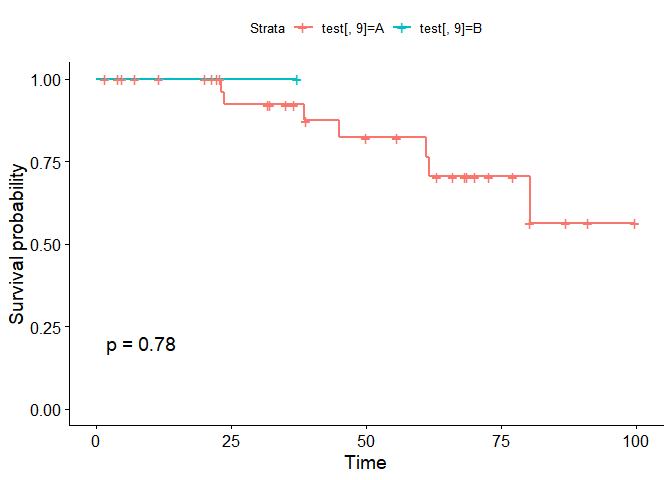
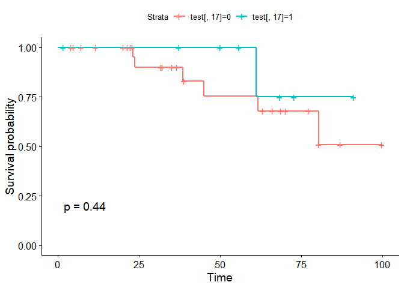

survivals in R
================

``` r
library(survival)
library(Gifi)
```

    ## Warning: package 'Gifi' was built under R version 3.6.3

``` r
library(survminer)
```

    ## Warning: package 'survminer' was built under R version 3.6.3

    ## Loading required package: ggplot2

    ## Warning: package 'ggplot2' was built under R version 3.6.3

    ## Loading required package: ggpubr

    ## Warning: package 'ggpubr' was built under R version 3.6.3

``` r
library(readr)
```

``` r
a<- read.csv("dat3.csv")
a$Initial_tx <- as.factor(a$Initial_tx)
a$child_Pugh_class_p <- as.factor(a$child_Pugh_class_p)
a$gender <- as.factor(a$gender)
a$bileduct <- as.factor(a$bileduct)
a$perihv<- as.factor(a$perihv)
a$peripv <- as.factor(a$peripv)
a$subcapsular <- as.factor(a$subcapsular)
a$Subphrenic <- as.factor(a$Subphrenic)
a <- a[,-17] ## 값이 0 밖에 존재하지 않아여 지우기
```

``` r
test <- a
test <- na.omit(test)


survi <- Surv(time = test$os_time, event = test$death)
fit1 <- survfit(survi~test$Initial_tx,data=test)
```

## Quarterly Results

### blank

1.  ggsurvplot을 사용

### some thing2

``` r
 ggsurvplot(survfit(survi~test[,1]),data=test,pval=T)
```

<!-- -->

``` r
ggsurvplot(survfit(survi~test[,4]),data=test,pval=T) #
```

<!-- -->

``` r
ggsurvplot(survfit(survi~test[,5]),data=test,pval=T) #
```

<!-- -->

``` r
ggsurvplot(survfit(survi~test[,6]),data=test,pval=T) #
```

<!-- -->

``` r
ggsurvplot(survfit(survi~test[,7]),data=test,pval=T)  
```

<!-- -->

``` r
ggsurvplot(survfit(survi~test[,8]),data=test,pval=T) #
```

<!-- -->

``` r
  ggsurvplot(survfit(survi~test[,9]),data=test,pval=T) ## 의미없는 범주형
```

<!-- -->

``` r
ggsurvplot(survfit(survi~test[,10]),data=test,pval=T) #
```

<!-- -->

``` r
ggsurvplot(survfit(survi~test[,11]),data=test,pval=T) #
```

<!-- -->

``` r
ggsurvplot(survfit(survi~test[,12]),data=test,pval=T) #
```

<!-- -->

``` r
 ggsurvplot(survfit(survi~test[,13]),data=test,pval=T) #범주형 #
```

<!-- -->

``` r
 ggsurvplot(survfit(survi~test[,14]),data=test,pval=T) #범주형 #
```

<!-- -->

``` r
 ggsurvplot(survfit(survi~test[,15]),data=test,pval=T) #범주형
```

<!-- -->

``` r
  ggsurvplot(survfit(survi~test[,16]),data=test,pval=T) ## 의미없는 범주형
```

<!-- -->

``` r
 ggsurvplot(survfit(survi~test[,17]),data=test,pval=T) #범주형 #
```

<!-- -->

``` r
 ggsurvplot(survfit(survi~test[,18]),data=test,pval=T) #범주형
```

<!-- -->

#### p\_value 계산

``` r
cox_f<-function(x){
  result <- coxph(survi~test[,x],data=test)
  print(result)
}
```
